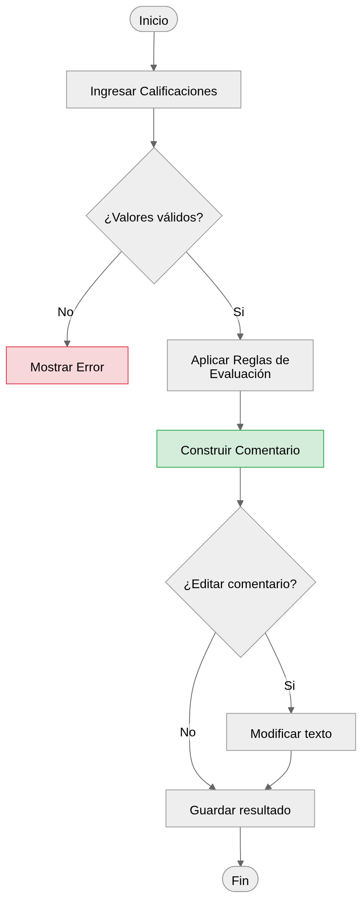
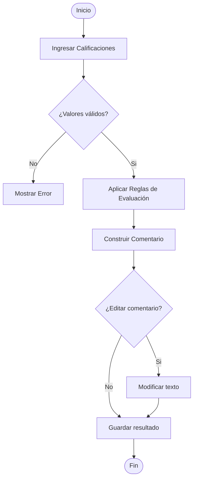
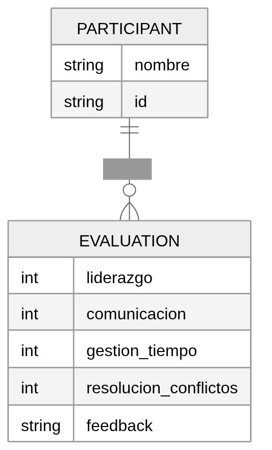

# 📄 Especificación de Requisitos de Software (SRS)
**Proyecto:** BeLabs Performance Feedback System  
**Versión:** 1.0.0  
**Estado:** Documento Base  
**Estándar:** ISO 29148 / IEEE 830  

---

## 1. Introducción

### 1.1 Propósito
El propósito de este documento es definir las especificaciones funcionales y técnicas del sistema **BeLabs Performance Feedback System**, el cual permitirá generar observaciones estructuradas sobre el desempeño de participantes en evaluaciones prácticas.

Este documento servirá como referencia formal para el desarrollo, validación y evolución del sistema, asegurando trazabilidad y calidad del producto final.

---

### 1.2 Alcance del Sistema
El sistema permitirá generar comentarios de desempeño a partir de la evaluación de habilidades específicas observadas durante sesiones de BeLabs.

Estas evaluaciones se realizan en contextos simulados de trabajo, con grupos reducidos (máximo 6 participantes) y una duración aproximada de 20 a 30 minutos.

El sistema:

- Recibirá calificaciones numéricas (1 a 10) por habilidad
- Procesará estas entradas mediante un conjunto de reglas definidas
- Generará automáticamente un comentario estructurado
- Permitirá la edición manual del resultado antes de su uso final
- Permitirá almacenar resultados para consultas posteriores

---

## 2. Descripción General

### 2.1 Perspectiva del Producto
El sistema será una aplicación de consola desarrollada en Java, independiente de otros sistemas, enfocada en la generación de observaciones mediante lógica interna basada en reglas.

No requerirá conexión a internet ni integración con servicios externos en su versión inicial.

---

### 2.2 Funciones del Producto

- **Ingreso de Evaluaciones:** Captura de valores numéricos por habilidad
- **Procesamiento de Reglas:** Interpretación de los valores mediante lógica híbrida
- **Generación de Feedback:** Construcción automática de un comentario estructurado
- **Edición de Comentarios:** Posibilidad de modificar el resultado generado
- **Persistencia (opcional):** Almacenamiento de resultados por participante

---

## 3. Requisitos Específicos

### 3.1 Requisitos Funcionales (RF)

| ID | Nombre | Descripción | Prioridad |
|:---|:---|:---|:---:|
| **RF-01** | Ingreso de Evaluación | El sistema DEBE permitir ingresar valores numéricos (1–10) para cada habilidad evaluada. | Alta |
| **RF-02** | Generación de Feedback | El sistema DEBE generar un comentario estructurado basado en reglas predefinidas a partir de las calificaciones ingresadas. | Alta |
| **RF-03** | Edición de Comentario | El sistema DEBE permitir modificar manualmente el comentario generado antes de su almacenamiento o uso. | Alta |
| **RF-04** | Estructuración del Comentario | El sistema DEBE organizar el feedback en secciones coherentes (inicio, desarrollo por habilidades, cierre). | Media |
| **RF-05** | Persistencia de Resultados | El sistema DEBE permitir almacenar los comentarios generados asociados a un participante. | Media |

---

### 3.2 Requisitos No Funcionales (RNF)

| ID | Atributo | Requisito de Calidad |
|:---|:---|:---|
| **RNF-01** | Usabilidad | El sistema debe permitir generar un comentario completo en menos de 10 segundos. |
| **RNF-02** | Rendimiento | El tiempo de generación del feedback debe ser menor a 1 segundo. |
| **RNF-03** | Portabilidad | El sistema debe ejecutarse en cualquier entorno que soporte Java (JVM). |

---

## 4. Modelado Lógico (Diagramas Mermaid)

### 4.1 Flujo de Generación de Feedback

### 4.2 Modelo de Datos (Simplificado)

## 5. Lógica del Sistema (Enfoque Híbrido)

El sistema NO generará comentarios mediante combinaciones exhaustivas de valores.

En su lugar, utilizará un enfoque híbrido basado en:

- Reglas independientes por habilidad
- Agrupación de resultados en niveles (alto, medio, bajo)
- Construcción dinámica del texto mediante plantillas

**Ejemplo conceptual:**

- Liderazgo alto → frase positiva  
- Comunicación media → frase neutra con mejora  
- Gestión baja → recomendación específica  

El comentario final será la concatenación coherente de estas evaluaciones parciales.

---

## 6. Matriz de Trazabilidad de Requisitos (RTM)

| ID Req | Módulo de Código (Implementation) | Caso de Prueba (Validation) | Estado |
|:---|:---|:---|:---:|
| **RF-01** | `InputHandler.java` | `InputTest.java -> valid range 1-10` | ⏳ |
| **RF-02** | `FeedbackGenerator.java` | `FeedbackTest.java -> rule application` | ⏳ |
| **RF-03** | `Editor.java` | `EditTest.java -> modify output` | ⏳ |
| **RF-04** | `TemplateEngine.java` | `StructureTest.java` | ⏳ |

---

## 7. Gestión de Cambios (Control de Versiones)

| Versión | Fecha | Autor | Descripción del Cambio | Motivo |
|:---|:---|:---|:---|:---|
| 1.0.0 | 2026-03-26 | Célula Tierra | Adaptación inicial del SRS al sistema BeLabs. | Inicio del proyecto |

---

## 8. Glosario

- **Feedback estructurado:** Comentario generado a partir de reglas definidas, no aleatorio.
- **Evaluación BeLabs:** Simulación de entorno laboral para medir desempeño.
- **Lógica híbrida:** Combinación de reglas independientes y plantillas dinámicas.
- **SRS:** Software Requirements Specification.
- **RTM:** Requirements Traceability Matrix.
